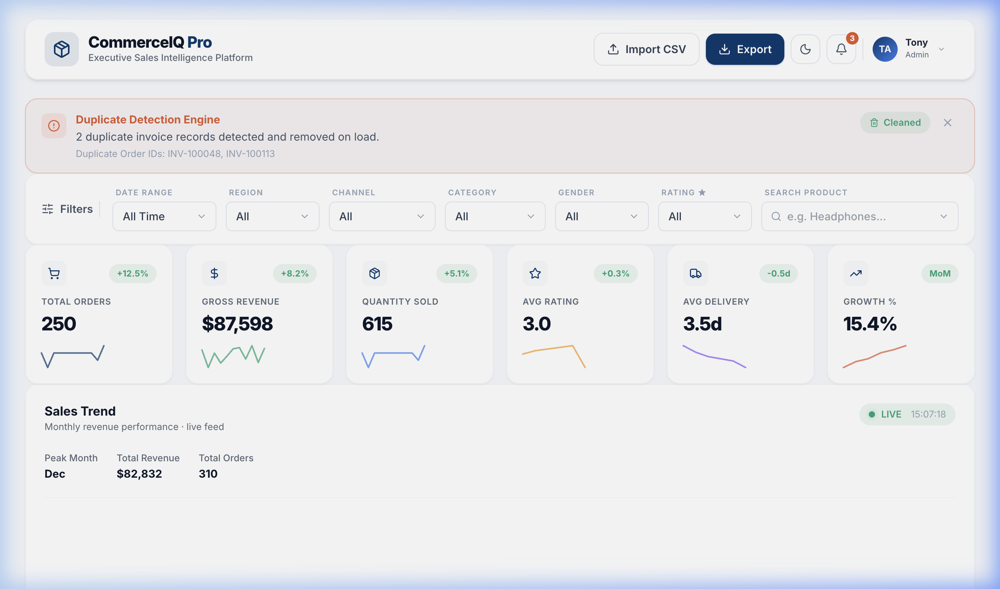
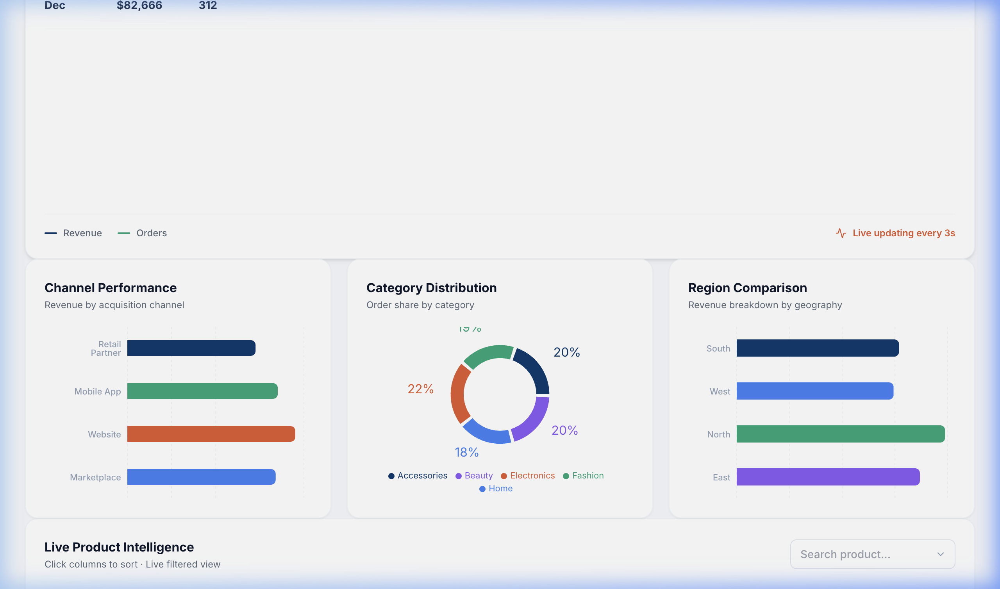
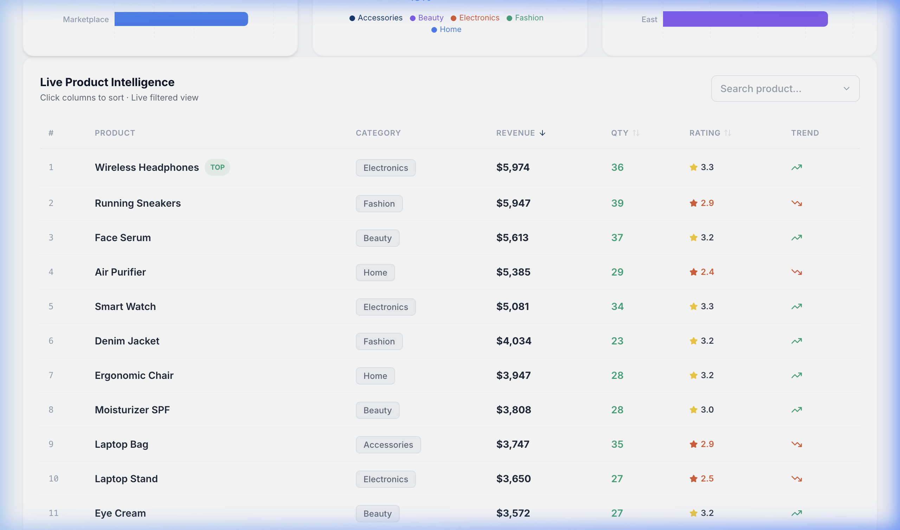
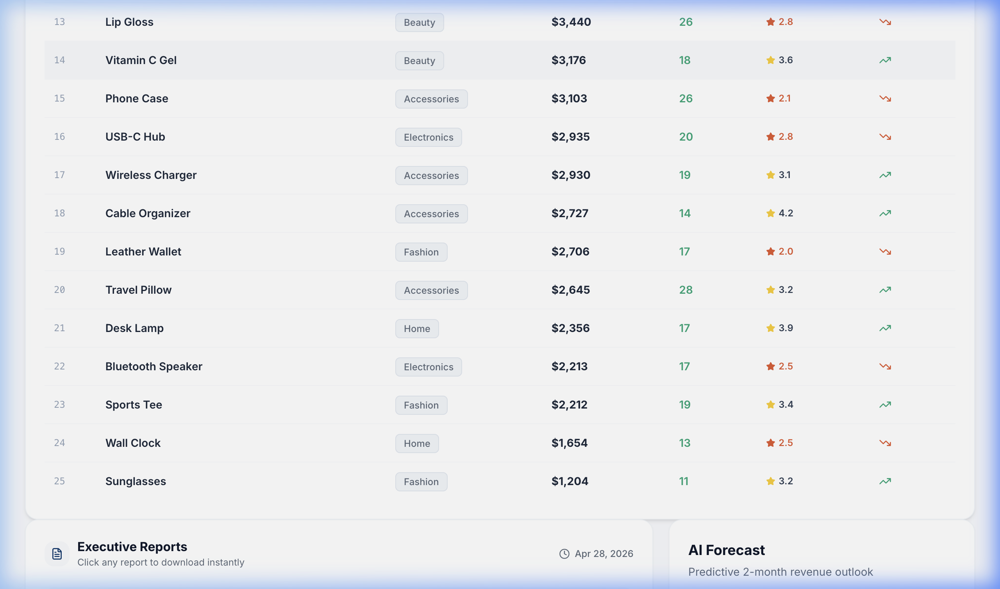
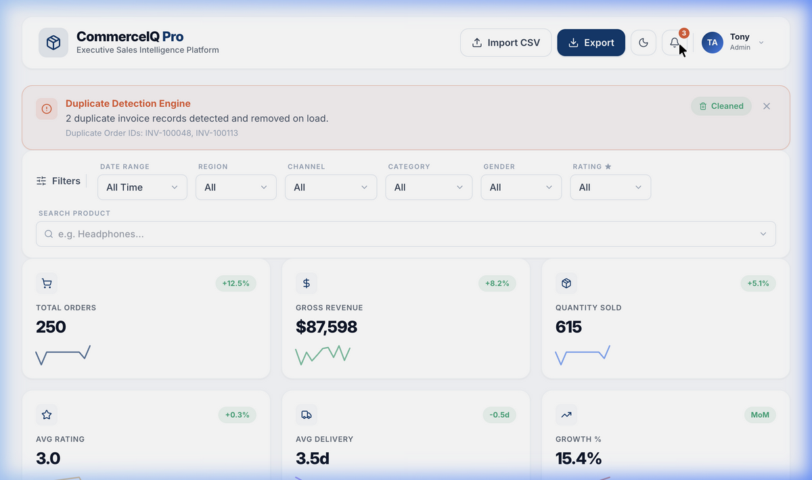
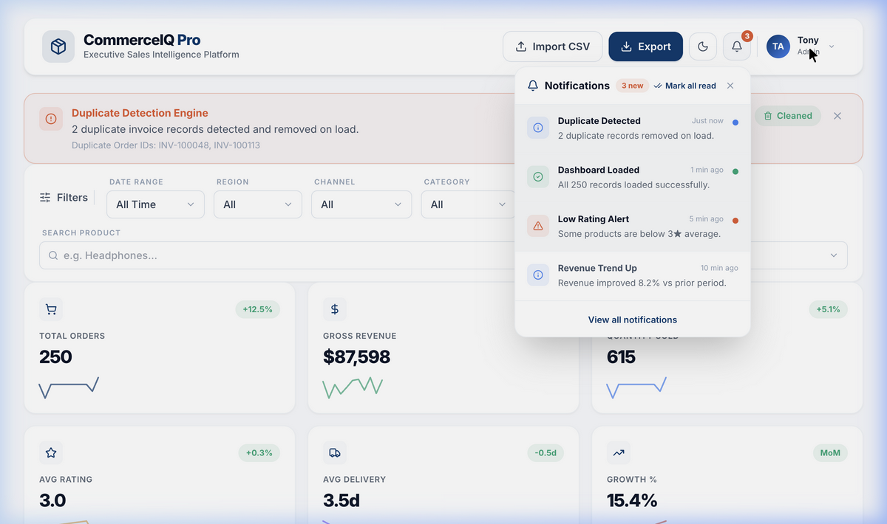

<div align="center">

# 🛒 CommerceIQ Pro

### Executive Sales Intelligence Platform

**Production-grade, FAANG-style analytics dashboard built with React + Vite + Tailwind CSS**

[](https://react.dev/)
[](https://vitejs.dev/)
[](https://tailwindcss.com/)
[](https://recharts.org/)
[](https://www.framer.com/motion/)
[](./LICENSE)
[](https://github.com/)
[](https://github.com/)

---

*Designed to operate like a real SaaS BI product — not just a chart page.*

[View Live Demo](#) · [Report Bug](https://github.com/) · [Request Feature](https://github.com/)

</div>

---

## 📸 Dashboard Preview

### 🏠 Header · Executive Filters · KPI Intelligence Cards


### 📊 Analytics Suite — Sales Trend · Channel · Category · Region


### 📋 Live Product Intelligence Table


### 📄 Executive Reports · ⚙️ System Settings


### 🔔 Notification Center


### 👤 Profile Module


---

## 🚀 Feature Overview

<table>
<tr>
<td valign="top" width="50%">

### 🏠 Executive Header
- CommerceIQ Pro branding & logo
- Import CSV — auto-parsed & deduplicated
- Export: Excel · CSV · PDF · Screenshot
- Light / Dark theme toggle
- 🔔 Notification bell with unread badge
- 👤 Full Profile module

</td>
<td valign="top" width="50%">

### 🎛️ FAANG Executive Filters
- **7 live slicers** — all update in real-time:
  - Date Range · Region · Channel
  - Category · Gender · Rating ★
  - Product Search (live text filter)

</td>
</tr>
<tr>
<td valign="top">

### 📈 KPI Intelligence Cards (6 Cards)
| KPI | Metric |
|-----|--------|
| Total Orders | Transaction count |
| Gross Revenue | Currency-aware |
| Quantity Sold | Total units |
| Avg Rating | Customer satisfaction |
| Avg Delivery | Logistics (days) |
| Growth % | MoM trend |

> Each card includes an **inline SVG sparkline** + trend badge

</td>
<td valign="top">

### 📊 Recharts Analytics Suite
| Chart | Type |
|-------|------|
| Sales Trend | Area · **Live 3s ticker** |
| Channel Performance | Horizontal Bar |
| Category Distribution | Donut Chart |
| Region Comparison | Horizontal Bar |
| AI Forecast | Projected Line |

</td>
</tr>
<tr>
<td valign="top">

### ⚠️ Duplicate Detection Engine
- Auto-scans all data for duplicate `Invoice_ID`
- Strips duplicates before KPI calculation
- Alert banner with exact IDs + "Cleaned" badge
- Fires notification on detection

</td>
<td valign="top">

### 📋 Live Product Intelligence Table
- Sortable: Revenue · Quantity · Rating
- Live search within table
- **TOP badge** for highest revenue product
- Trend icons: rising 🟢 / declining 🔴

</td>
</tr>
<tr>
<td valign="top">

### 📄 Executive Reports (Functional)
| Report | Format | Action |
|--------|--------|--------|
| Weekly Report | `.xlsx` | Last 50 filtered orders |
| Monthly Summary | `.csv` | Month-by-month revenue |
| Risk Report | `.xlsx` | Low-rating + late delivery |
| Forecast Report | `.pdf` | Full dashboard snapshot |

> Shows **Generating… → Downloaded ✓** feedback

</td>
<td valign="top">

### 👤 Profile Module
- Editable name + role + email
- Access level: Admin · Analyst · Executive · Viewer
- **Analytics Strip**: Last Login · Uploads · Exports
- Quick Preferences: Theme · Currency · Language
- Saved Reports list
- Sign Out button

</td>
</tr>
<tr>
<td valign="top">

### 🔔 Notification Center
- 4 types: Info · Success · Warning · Error
- Auto-triggered: import, export, duplicates, alerts
- Mark single / mark all as read
- Animated unread badge counter

</td>
<td valign="top">

### ⚙️ System Settings
| Setting | Options |
|---------|---------|
| Appearance | Light / Dark |
| Currency | 9 countries with flags 🇺🇸🇮🇳🇪🇺🇬🇧🇯🇵🇨🇦🇦🇺🇸🇬🇦🇪 |
| Language | 9 country-based languages |
| Number Format | International / Indian |

</td>
</tr>
</table>

---

## 🛠️ Tech Stack

[](https://react.dev/)
[](https://vitejs.dev/)
[](https://tailwindcss.com/)
[](https://recharts.org/)
[](https://www.framer.com/motion/)
[](https://lucide.dev/)
[](https://www.papaparse.com/)
[](https://sheetjs.com/)
[](https://jspdf.io/)
[](https://html2canvas.hertzen.com/)

---

## 📁 Project Structure

```
commerceiq/
├── public/
│
├── src/
│   ├── charts/
│   │   ├── SalesTrendChart.jsx       ← Live 3s ticker + NOW reference line
│   │   ├── ChannelChart.jsx          ← Revenue by channel
│   │   ├── CategoryDonutChart.jsx    ← Order share donut
│   │   ├── RegionChart.jsx           ← Geographic bar chart
│   │   └── ForecastChart.jsx         ← Projected outlook
│   │
│   ├── components/
│   │   ├── Header.jsx                ← Enterprise FAANG header
│   │   ├── KPIcards.jsx              ← 6 cards + inline sparklines
│   │   ├── DuplicateAlert.jsx        ← Deduplication alert banner
│   │   ├── ProductTable.jsx          ← Sortable + searchable table
│   │   ├── SettingsPanel.jsx         ← Currency, Language, Theme
│   │   ├── NotificationBell.jsx      ← Notification center
│   │   └── ProfileMenu.jsx           ← Full profile module
│   │
│   ├── context/
│   │   └── DataContext.jsx           ← Global analytics engine + all state
│   │
│   ├── data/
│   │   └── mockData.js               ← 250 realistic orders + injected duplicates
│   │
│   ├── exports/
│   │   ├── ExportPanel.jsx           ← 4-mode export dropdown
│   │   ├── exportExcel.js            ← XLSX workbook generator
│   │   └── exportPDF.js              ← jsPDF + html2canvas
│   │
│   ├── filters/
│   │   └── FilterBar.jsx             ← 7 FAANG executive filters
│   │
│   ├── insights/
│   │   └── ExecutiveReports.jsx      ← Functional real-download reports
│   │
│   ├── utils/
│   │   ├── csvParser.js              ← PapaParse wrapper
│   │   └── duplicateDetector.js      ← Invoice_ID deduplicator
│   │
│   ├── App.jsx                       ← Layout assembly
│   ├── main.jsx
│   └── index.css                     ← Professional CSS token system
│
├── docs/
│   └── screenshots/                  ← Dashboard preview images
│
├── tailwind.config.js                ← Custom color tokens + dark mode
├── vite.config.js
└── package.json
```

---

## ⚙️ Quick Start

### 1. Clone the repository
```bash
git clone https://github.com/AakashSsiva/CommerceIQ-Pro.git
cd CommerceIQ-Pro
```

### 2. Install dependencies
```bash
npm install
```

### 3. Start the development server
```bash
npm run dev
```
Opens at **[http://localhost:5173](http://localhost:5173)**

### 4. Build for production
```bash
npm run build
```
Outputs optimized bundle to `dist/` — deploy-ready.

---

## 🚀 Deployment

| Platform | Steps |
|----------|-------|
| **Vercel** | `vercel --prod` or connect GitHub repo |
| **Netlify** | Drag `dist/` folder to Netlify dashboard |
| **GitHub Pages** | Set `base` in `vite.config.js` + `gh-pages` |

---

## 💡 How to Use

### Importing Data
1. Click **"Import CSV"** in the header
2. Upload a `.csv` with columns: `Order_ID`, `Date`, `Region`, `Channel`, `Category`, `Product`, `Price`, `Quantity`, `Rating`
3. The engine auto-parses, deduplicates, and hot-reloads all charts

### Exporting Data
1. Click **"Export"** dropdown → choose Excel · CSV · PDF · Screenshot
2. Download triggers instantly
3. Export counter in Profile increments live

---

## 🎨 Design System

| Token | Light | Dark |
|-------|-------|------|
| Background | `#F7F9FC` | `#020617` |
| Card | `#FFFFFF` | `#0F172A` |
| Primary | `#003A70` | — |
| Accent | — | `#3B82F6` |
| Positive | `#00A676` | `#00A676` |
| Alert | `#E4572E` | `#E4572E` |
| Text | `#5F6B7A` | `#94a3b8` |

---

## 📊 What This Demonstrates

[](https://github.com/)
[](https://github.com/)
[](https://github.com/)
[](https://github.com/)
[](https://github.com/)
[](https://github.com/)

---

## 📜 License

```
MIT License — free to use, modify, and distribute.
```

---

<div align="center">

**Built with ❤️ for professional analytics portfolios**

[](https://github.com/AakashSsiva/CommerceIQ-Pro)
[](https://github.com/AakashSsiva/CommerceIQ-Pro)

*If this project helped you, consider giving it a ⭐ on GitHub!*

</div>
